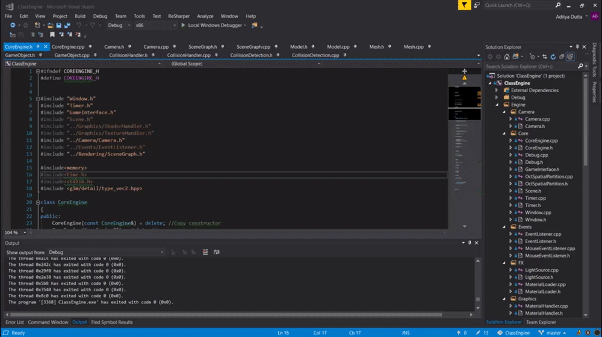

# ClassEngine

An engine made using C++, OpenGL and SDL. Currently under development.

### Current Features
⋅⋅* Scene Graph
⋅⋅* Frustum Culling
⋅⋅* Spatial Partitioning
⋅⋅* Events System
⋅⋅* Collision Handler
⋅⋅* Ray Casting
⋅⋅* Object Loading
⋅⋅* Particle System

### Future Features
⋅⋅* Networking System
⋅⋅* PhysX System
⋅⋅* Animation System
⋅⋅* Text System
⋅⋅* ImGUI Interface
